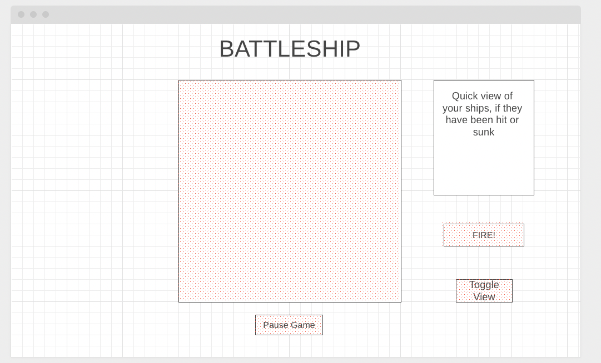

# BATTLESHIP

Welcome Aboard Captain!  Your naval armada is primed for battle.  Are you ready to lead us to victory?

## About the Game
This is a two player game wehre players place 5 battleships on their 10 x 10 grids and then take turns guessing where the other player has placed their ships, one square at a time.  Once you find where your opponent placed their ships, you win!

## How to Play
### Step 1: Grab a Friend!
Click this link to play: <a href="https://play-battleship.netlify.app/">PLAY</a>
### Step 2: Setup Phase
Take turns placing all of your ships onto your board.
### Step 3: Battle Phase
Take turns selecting a target square in enemy territory to fire upon.  If you fire upon one of their ships, you will be alerted via a bright red indicator.  If you miss, the square will be neutral.
### Step 4: Endgame
Repeat step 3 until all of a player's ships are sunk.  The last player with ships remaining wins!    

## Technologies Used
Javascript, HTML, CSS, and Bootstrap

## How It's Made

### Pseudo-code
1. Create a start screen with the title of game and a button to start a new game
2. Setup Phase
   1. Display Title of the Game
   2. Display a message saying "Player [X] Place your Ships"
   3. Display a 10 x 10 grid in the center of the window.
   4. Display a side panel section with ships
   5. Display a button to rotate ships that have yet to be placed
   6. Display a button to confirm ship placement
      1. When pressed it must check if all ships are placed
         1. If not must change the message to the player
      2. If all ships are place, ships position are saved to the state
      3. Goes to next phase 
         1. Either setup for player 2
         2. Continue to the battle phase
   7. Display a button to exit the game
3. Battle Phase
   1. Keep title of the game, 10 x 10 grid, and button to exit the game
   2. Display message saying "Player [X] turn, select coordinates to fire torpedo"
   3. Allow player to click on a square that has not been targeted before
      1. Squares that have been targeted should appear as different colors
   4. On the right side of the window, show a quick view on players ships
      1. if they have been hit or sunk
   5. Display a button to toggle ship view 
      1. This is where players can see where their opponent has targeted, where the player's ships are, if they have been hit
   6. Display a fire button to confirm targeted square
      1. Should not work if a square is not targeted
      2. Would move the game to next state/screen accordingly
4. Endgame
   1. Should display title of the game
   2. Should display winner of the game
   3. Should have a button to restart

## Resources Used
<u>Bootstrap</u>   <a href="https://getbootstrap.com/">Bootstrap</a>
 
<u>Favicon</u>   <a target="_blank" href="https://icons8.com/icon/24072/battleship">Battleship</a> icon by <a target="_blank" href="https://icons8.com">Icons8</a>
 
<u>Sunk Sound Effect</u>   <a href="https://freesound.org/people/tommccann/sounds/235968/">Explosion_01 freesound</a>
 
<u>Fire Sound Effect</u>   <a href="https://freesound.org/people/CGEffex/sounds/86989/"> Shoot off_Ringy5 freesound</a>
 
<u> Hit Sound Effect </u>   <a href="https://freesound.org/people/thanvannispen/sounds/9565/">industrial_blast06 freesound</a>
 
<u> Battleship Font </u>   <a href="https://www.ffonts.net/NFL-Dolphins.font.download"> NFL Dolphins ffont</a>
 

## Next Steps
- Add sea shanties to the background
- Add torpedo sounds
- Add voice over sounds
- Sound effects
- Quick lock code to prevent players from playing for the other player 
- Radar option
- Bombs for fake hits
- airstrikes
- Big bombs
